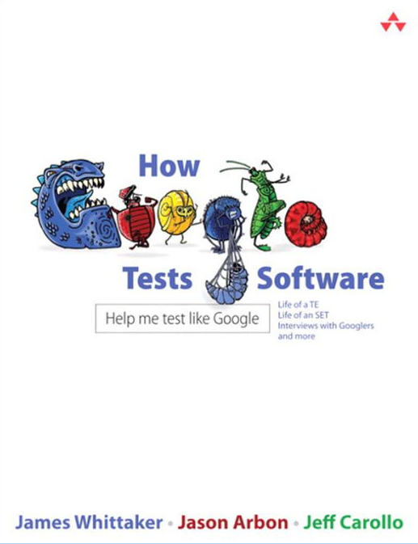
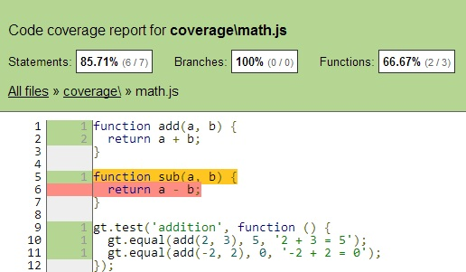
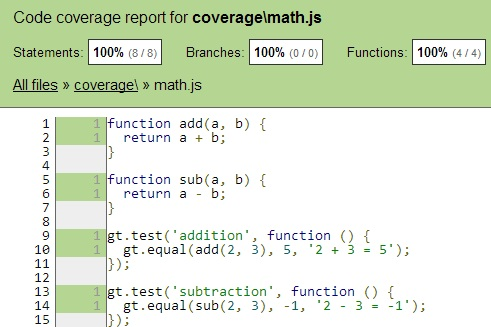
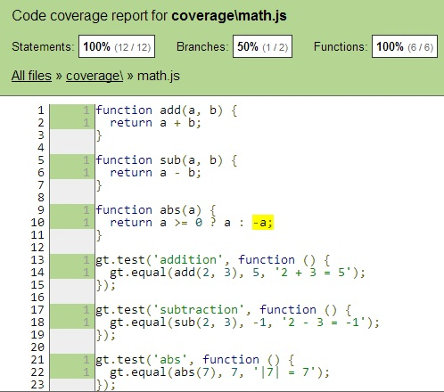
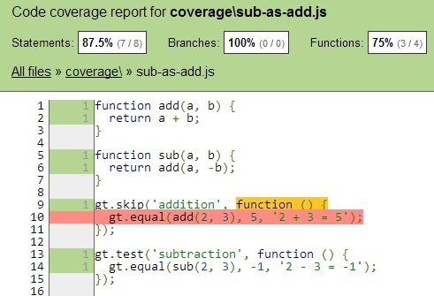
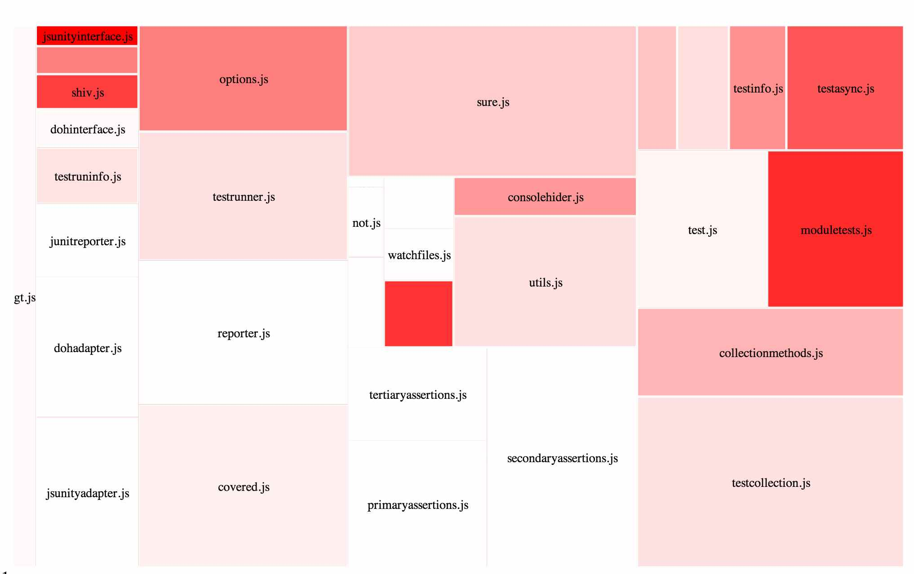
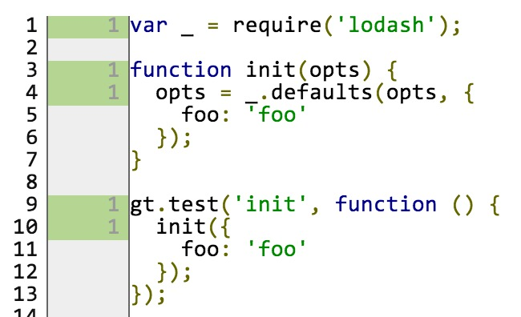

# Code Coverage and Testing

Dr. Gleb Bahmutov, PhD

[uTest](http://www.utest.com/) **@bahmutov**

[https://github.com/bahmutov/talks](https://github.com/bahmutov/talks)

## UTest

In the wild testing for mobile / web apps

* real people
* real devices
* real locations

Important to have base quality level before handing off
an app to the testers.

## Axiom 1

If collecting code coverage is hard - it will be skipped


Axiom 2 - tests add weight


Test classification



## Code Coverage usefulness

* small tests - extremely useful
* medium tests - less helpful
* large tests - not helpful


Small tests


## Example math.js

```
function add(a, b) {
  return a + b;
}

function sub(a, b) {
  return a - b;
}

test('addition', function () {
  equal(add(2, 3), 5, '2 + 3 = 5');
  equal(add(-2, 2), 0, '-2 + 2 = 0');
});
```

## Flexibility

```
gt math.js
gt tests/**/s*.js
gt -t "add*" math.js
gt -m "math" lots-of-tests.js
```

### coverage is collected by default in all cases


## Code coverage use 1

Detect features not covered by tests


coverage




Added subtraction test



Don't forget branches



## My personal target

* > 85% for the code
* > 95% for the tests
* Use [Jenkins](http://jenkins-ci.org/) to check the coverage level
* Keep tests **DRY**

## Small tests coverage challenges

* avoid coverage *by accident*
* covering all paths
  * IE7 + print media CSS + small screen in portrait


Developers are stateless


Test skipped but code is still covered



## Covering all paths

```
// individual coverage info file
DA:1,1  <-- line number 1, covered
DA:2,1
DA:5,1
DA:6,0  <-- line number 6, not covered
DA:9,1
...
```

## Combine results

If tests run in multiple environments, there should
be a way to combine results to show unified results.

```
coverage-ie OR coverage-chrome = coverage-all
```

## Test overlap analysis

1. Run each unit test separately
2. Compute overlap line by line


## Test / code overlap

```
                   add     sub
addition test      100%    0%
subtraction test   100%    100%
```

If running **subtraction**, do not run **addition**

At least, run **subtraction** first

## Code coverage use 2

Show technical debt

## Testing + Code Complexity

```
  function add(a, b) { return a + b }
  // cyclomatic = 1
  // halstead volume = 2

  function abs(a, b) {
    return a >= 0 ? a : -a
  }
  // cyclomatic = 2
  // halstead volume = 3
```

[npmjs.org/package/jsc](https://npmjs.org/package/jsc),
[grunt-complexity](https://github.com/vigetlabs/grunt-complexity),
[complexity-report](https://github.com/philbooth/complexity-report),
[plato](https://npmjs.org/package/plato)


[risk-map](http://glebbahmutov.com/risk-map)



## Code coverage use 3

Speed up test execution


Every test updates local [*untested*](https://npmjs.org/package/untested) database

```
gt mathTests.js
// mathTests.js covers math.js AND utils.js

gt utilsTest.js
// utilsTest.js covers utils.js

// edit utils.js

untested
// runs utilsTest.js AND mathTests.js
```


## Problems

* Keeping tests up to date
* Code coverage collection
  * Speed, flexibility
  * Multi-environment setup
* Fundamental limit
* Code coverage vs input coverage


## Code base size and speed

```
foo/
  bar/
    10k source files
  cat/
    2k source files
    1 changed file
zoo/
  10k source files
```

### Avoid long preprocess step!

## Fundamental problem

100% code coverage means nothing and is very hard to get


## Example

```
var foo = function () {
  foo = null;
  return true;
}

test('foo', funciton () {
  ok(foo(), 'foo returns true');
  // hmm, what if we call foo again?
});
```

## Meaningless 100%

Checking email format

```
var emailRegex =
/^[A-Z0-9.-]+@[A-Z0-9.-]+\.[A-Z]$/

ok(emailRegex.test('gleb@gleb.com'));
```

Official RFC 2822 [standard email regex](http://www.regular-expressions.info/email.html)
is over 400 characters long!


## Switch to data coverage

```
test('valid emails', function () {
  ok(isEmail('b@b.com'));
  ok(isEmail('b-b@b.com'));
  ...
});

test('invalid emails', function () {
  ok(!isEmail('bb.com'));
  ok(!isEmail('b@b@b.com'));
  ...
});
```


Default options using code


Default options using object



## Obligatory math

    N * 0.8 < N/2 * 0.8 + N/2 * 0.8

Split a large file and cover at same ratio.


Medium tests


## Medium tests

Tests check how pieces come together, some pieces are mocks.

Covering all code paths seems pointless.


Large tests


## Large tests

Tests try to verify that the user features are working.

Covering all source code is impossible.


Cross language / system barriers


Unused and 3rd party code


worse in reality


Unit testing can be exhaustive


Large testing is limited


## Conclusions

* Set up code coverage to be as easy as pie
* Use code coverage with *small* tests
  * combine with complexity
  * speed up tests
  * remember limitations
* Do not shoot for 100% code coverage


[slides-now-footer]: "@bahmutov code coverage and testing"
[slides-now-theme]: "bw"
[slides-now-timer]: "40"
